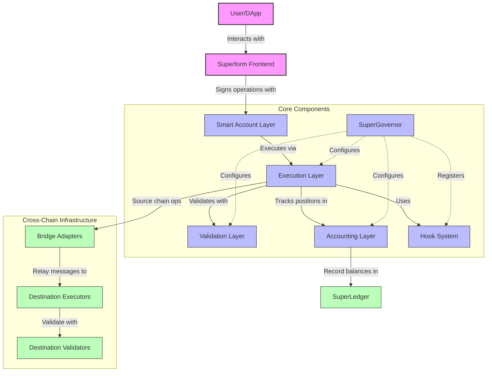
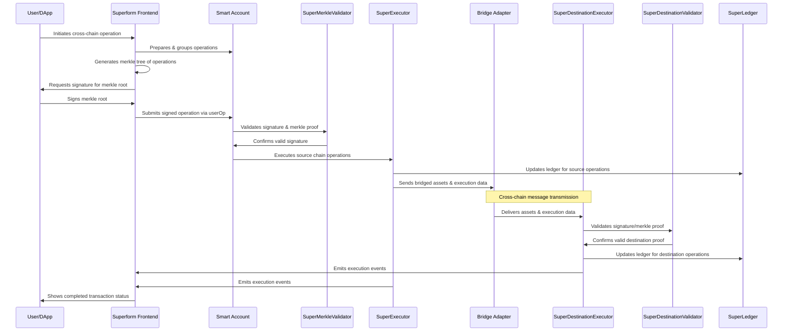
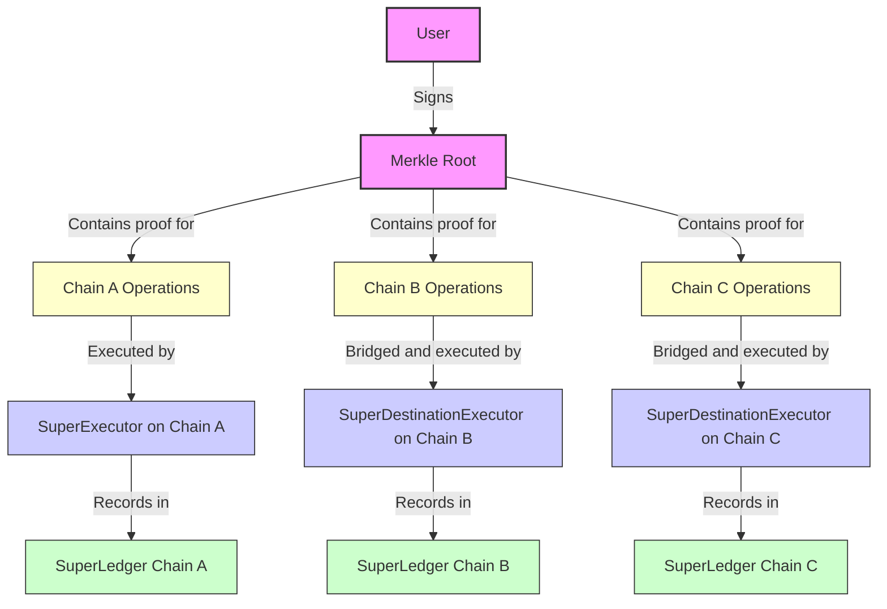

# Overview

Superform v2 is a modular DeFi protocol for yield abstraction that allows dynamic execution and flexible composition of user operations via ERC7579 modules.

This document provides technical details, reasoning behind design choices, and discussion of potential edge cases and risks in Superform's v2 contracts.

The protocol consists of the following components:

- **Core System**: The primary business logic, interfaces, execution routines, accounting mechanisms, and validation components

## Repository Structure


```
src/
├── core/               # Core protocol contracts
│   ├── accounting/     # Accounting logic
│   ├── adapters/       # Bridge implementations
│   ├── executors/      # Execution logic contracts
│   ├── hooks/          # Protocol hooks
│   ├── interfaces/     # Contract interfaces
│   ├── libraries/      # Shared libraries
│   ├── paymaster/      # Native paymaster
│   └── validators/     # Validation contract
└── vendor/             # Vendor contracts (NOT IN SCOPE)
```

## Key Components

The following diagram illustrates how users interact with the Superform system and how the different components work together.



### User Interaction Flow

Smart accounts that interact with Superform must install four essential ERC7579 modules:

- SuperExecutor / SuperDestinationExecutor: Installs hooks and executes operations.
- SuperMerkleValidator / SuperDestinationValidator: Validates userOps against a Merkle root.



### Execution Layer

#### Hooks

Hooks are lightweight, modular contracts that perform specific operations (e.g., token approvals, transfers) during an execution flow. Hooks are designed to be composable and can be chained together to create complex transaction flows. If any hook fails, the entire transaction is reverted, ensuring atomicity.

Key Points for Auditors:

- Modularity & Ordering: Hooks can be arranged in any order within a user operation. Their execution order is defined by
  the build function of the SuperExecutor.
- Pre/Post Execution: Each hook can have pre-execution and post-execution functions. These functions update internal
  transient storage to maintain state between hook invocations.
- Known Considerations:
  - Complex interdependencies may arise if hooks are misconfigured.
  - Failure handling is strict (reverting the entire operation on a specific hook failure).
  - All hooks are executed within the smart account context. This is why many typical checks on slippage or other
    behaviour can be disregarded, because the assumption is that the user will agree to the ordering and the type of
    hooks provided and this choice will solely affect his account and not the entire core system of contracts.
  - Anyone can create a hook including a malicious one. Users select which hooks to use, but ultimately it is up to the
    SuperBundler to provide the correct suggestions for users in the majority of the cases. Therefore users place a
    certain degree of trust in SuperBundler

#### SuperExecutor and SuperDestinationExecutor

SuperExecutor is the standard executor that sequentially processes one or more hooks on the same chain. It manages transient state storage for intermediate results, performs fee calculations, and interacts with the SuperLedger for accounting. It is responsible for executing the provided hooks, invoking pre- and post-execute functions to handle transient state updates and ensuring that the operation's logic is correctly sequenced.

SuperDestinationExecutor is a specialized executor for handling cross-chain operations on destination chains. It processes bridged executions, handles account creation, validates signatures, and forwards execution to the target accounts.

Key Points for Auditors:

- Inheritance: Inherits from ERC7579ExecutorBase to facilitate deployment on ERC7579 smart accounts.
- SuperDestinationExecutor:
  - Bypasses 4337 UserOp flow with some gas savings for the user
  - Allows account creation on destination
  - Note for auditors: important to check the ability to not replay transactions on destination and that all the elements
  included in the signature are enough for that.
- Accounting Integration: After hook execution, it checks hook types and calls updateAccounting on the SuperLedger when
  required.

#### Transient Storage Mechanism

Transient storage is used during the execution of a SuperExecutor transaction to temporarily hold state changes. This
mechanism allows efficient inter-hook communication without incurring high gas costs associated with permanent storage
writes.

Key Points for Auditors:

- Gas Efficiency:
  - Uses temporary, in-memory storage to avoid high SSTORE costs (5,000–20,000 gas).
- Limitations:
  - Only value types can be stored.
- Debugging is more challenging because intermediate states aren't persistently recorded.
- Design Rationale:
  - The trade-off is acceptable as it minimizes gas cost without impacting the integrity of the final state.


### Validation Layer

SuperValidatorBase is the base contract providing core validation functionality used across all validator implementations, including signature validation and account ownership verification.

#### SuperMerkleValidator and SuperDestinationValidator

SuperMerkleValidator and SuperDestinationValidator are used to validate operations through Merkle proof verification, ensuring only authorized operations are executed. They leverage a single owner signature over a Merkle root representing a batch of operations.

SuperMerkleValidator:
- Role: A validator contract for ERC4337 entrypoint actions. It enables users to sign once for multiple user operations using merkle proofs, enhancing the chain abstraction experience.
- Usage: Designed for standard ERC-4337 `EntryPoint` interactions. Validates `UserOperation` hashes (`userOpHash`) provided within a Merkle proof, typically constructed by the SuperBundler. Implements `validateUserOp` and EIP-1271 `isValidSignatureWithSender`.

SuperDestinationValidator:
- Role: Validates cross-chain operation signatures for destination chain operations. It verifies merkle proofs and signatures to ensure only authorized operations are executed.
- Usage: Specifically designed for validating operations executed *directly* on a destination chain via `SuperDestinationExecutor`, bypassing the ERC-4337 `EntryPoint`. Implements a custom `isValidDestinationSignature` method; `validateUserOp` and `isValidSignatureWithSender` are explicitly **not** implemented and will revert.
- Merkle Leaf Contents: `keccak256(keccak256(abi.encode(callData, chainId, sender, executor, adapter, dstTokens[], intentAmounts[], validUntil)))`. The leaf commits to the full context of the destination execution parameters.
- Replay Protection:
    - Includes `block.chainid` in the leaf and verifies it during signature validation to prevent cross-chain replay.
    - Incorporates a `validUntil` timestamp in the leaf, checked against `block.timestamp`.
    - Includes the `executor` address in the leaf to prevent replay across different executor modules installed on the same account.
    - Uses a unique namespace (`SuperValidator`) in the final signed message hash.
- Notes:
    - The destination account must use the same signer as the source account. If the validator is uninstalled and then reinstalled with a different configuration, the flow will no longer function correctly.
    - Execution occurs only if the account holds a balance greater than the corresponding intentAmounts[] for each token in dstTokens[].

Key Points for Auditors:

- Proof Verification Robustness: Examine the specific data included in each validator's Merkle leaf (detailed above) to confirm the scope of user authorization.
- Replay Attack Prevention: Assess the combination of mechanisms used by each validator (Merkle root commitment, `validUntil`, `nonce`/`userOpHash`, `chainId`, `executor` address, distinct namespaces) to prevent various replay scenarios.
- Signature Scheme: Ensure the EIP-191 compliant signature verification against the Merkle root and namespace is sound.
- Access Control: Verify that the signer check correctly uses the `_accountOwners` mapping initialized via `onInstall`.

### Accounting Layer

#### SuperLedger

Handles accounting aspects (pricing, fees) for both INFLOW and OUTFLOW operations. Tracks cost basis and calculates performance fees on yield. It ensures accurate pricing and accounting for INFLOW and OUTFLOW type hooks.

Key Points for Auditors:

- Oracle-Based Pricing:
  - The YieldSourceOracle derives price-per-share and other relevant metadata (for off-chain purposes) for yield
    sources.
  - Hooks are passed the yieldSourceOracleId to use. It is up for the SuperBundler to suggest / enforce the correct
    yieldSourceOracleIds to use, but nothing impedes a user to pass their own yieldSourceOracleId in a hook and bypass
    the fee. This is known and accepted.
- Multiple yield source oracle and ledger implementation system:
  - Provide more flexibility to adapt to yield source types that have special needs do determine fees for Superform
    (such as Pendle's EIP5115)
  - Risks may exist if the yield source oracles provide incorrect data, which may lead to no fees being taken by
    Superform.
  - It is also important to assess if a user can ever be denied of exiting a position (due to a revert) in a certain
    state due to influences on the price per share accounting and the SuperLedger used for that yield source.
  - SuperBundler will enforce the yieldSourceOracleId to use whenever a user interacts with it. Otherwise this cannot be
    enforced. Each yieldSourceOracle is paired with a ledger contract which users can also specify when configuring the
    yieldSourceOracle. This is a known risk for users (fully isolated to the user's account) if not interacting through
    the offchain SuperBundler and acknowledged by the team.

#### YieldSourceOracles

The system uses a dedicated on-chain oracle system to compute the price per share for accounting. Specialized oracles exist for different vault standards (ERC4626, ERC5115, ERC7540, etc.) that provide accurate price data and TVL information.

### Infrastructure

#### SuperBundler

A specialized off-chain bundler that processes ERC4337 userOps on a timed basis. It integrates with the validation system to ensure secure operation. Unlike typical bundlers that immediately forward userOps, SuperBundler processes them in a timed manner, allowing for batching and optimized execution.

Bundler Operation

- Allows fee charging in ERC20 tokens with a fee payment hook (a transfer hook), which transfers fees to the
  SuperBundler so that it can orchestrate the entire operation.
- Allows for a single signature experience flow, where the SuperBundler builds a merkle tree of all userOps that are
  going to be executed in all chains for a given user intent. This signature is validated in SuperMerkle Validator.
- Allows for delayed execution of userOps (async userOps) with a single user signature. UserOps are processed when and
  where required rather than immediately upon receipt. Reasonable deadlines apply here. Typical desired flow of usage is
  for example with asynchronous vaults like those following ERC7540 standard.
- Centralization Concerns:
  - Since SuperBundler controls both the userOp and validation flow, it introduces a degree of centralization. We
    acknowledge that this could be flagged by auditors.
  - In later stages this system is planned to be decentralized.
- Mitigation: Transparency around this design choice and the availability of fallback mechanisms when operations are not
  executed through SuperBundler.

#### Adapters

Adapters are a set of gateway contracts that handle the acceptance of relayed messages and trigger execution on destination chains via 7579 SuperDestinationExecutor.

Key Points for Auditors:

- Relayed message handling:
  - Both bridges expect the full intent amount to be available to continue execution on destinaton
  - The last relay to happen continues the operation
- Known and accepted cases:
  - Failure of a relay:
    - It is entirely possible for a relay to fail due to a lack of a fill by a solver. In these types of cases, the
      funds remain on source. Any funds that were relayed successfully will remain on destination and won't be bridged
      back. The assumption for the operation mode is chain abstraction/one balance, so it shouldn't matter for the user
      where the funds land.
  - Slippage loss due to bridging:
    - The user accepts the conditions the solver providers to execute the operations. All subsequent operations on
      destination are dependent on the actual value provided by the relayer. It is accepted that if the valued filled is
      substantially lower, execution continues anyway with the chained hooks (using the context awareness) and the users
      acknowledges this risk.
- Things to watch for:
  - Cancellation Scenarios:
    - User cancellations during pending bridge operations
    - Refund mechanisms when operations fail

#### SuperNativePaymaster

SuperNativePaymaster is a specialized paymaster contract that wraps around the ERC4337 EntryPoint. It enables users to pay for operations using ERC20 tokens from any chain, on demand. It's primarily used by SuperBundler for gas sponsoring. This functionality is necessary because of the SuperBundler's unique fee collection mechanism where userOps are executed on user behalf and when required.

Key Points for Auditors:

- Gas Management:
  - Gas estimation and pricing mechanisms
  - Refund handling for unused gas
- Integration Points:
  - EntryPoint interaction patterns
  - SuperBundler dependencies
  - Across gateway interaction
- Security Considerations:
  - DOS prevention
  - Gas price manipulation protection
  - Fund safety during conversions

#### SuperRegistry

Provides centralized address management for configuration and upgradeability.


## Areas of Interest

To ensure transparency and facilitate the audit process, the following points outline known issues and potential edge cases our team has identified:

### Cross-Chain Execution

Superform v2 implements a cross-chain execution mechanism using merkle trees and validator contracts to enable secure operations across different blockchains. This system allows users to sign a single transaction that can trigger actions across multiple chains.

This diagram illustrates how the merkle tree enables efficient cross-chain operations:



**Core Components**:

1. **Merkle Root Generation**:
   - When a user initiates a cross-chain action, a merkle tree is generated with leaves representing operations on different chains
   - The user signs the merkle root, not individual operations
   - Each leaf contains chain-specific data (chain ID, execution parameters, expiration time)

2. **Source Chain Execution**:
   - On the source chain, the SuperMerkleValidator verifies the user's signature against the merkle root
   - The source chain operations are executed through the merkle proof for that chain
   - Typically includes bridging assets to destination chains

3. **Destination Chain Execution**:
   - Bridge adapters call the SuperDestinationExecutor with bridged assets and execution data
   - The SuperDestinationValidator verifies the signature and merkle proof for destination operations
   - Upon validation, the SuperDestinationExecutor executes the intended operations

4. **Replay Protection**:
   - Each merkle root is tracked per user to prevent replay attacks
   - Operations can only be executed once per merkle root per user


**Issue 1**: Source chain transaction failures don't automatically invalidate destination chain operations.

**Scenario**: When a source chain transaction fails or is re-organized, but the signed merkle root remains valid:
- The destination chain execution can still be performed if the user's account has sufficient funds
- This is by design, as signed operations are considered valid user intents until their expiration time
- If the user is unaware and signs a second transaction for the same operation, both could potentially execute

**Behavior**:
- Signed merkle roots remain valid until their expiration timestamp
- Destination operations can execute independently if the account has sufficient funds
- Each signed operation represents a legitimate user intent that can be executed independently

**Technical Reasoning**:
- Cross-chain operations have inherent finality and atomicity limitations
- The system prioritizes ensuring valid signed operations can be executed rather than strict source-destination coupling
- The validation mechanism is designed to be permissionless, allowing anyone to submit a valid operation for execution

**Mitigation**:
- Clear user documentation and transaction monitoring tools
- Reasonable expiration times for signed operations (typically 1 hour)
- Comprehensive transaction status tracking in the frontend
- Users should monitor the execution status of both source and destination transactions
- The Superform frontend provides visibility into all pending and executed operations

### Hook System

**Issue**: If a hook is compromised, it can potentially manipulate the entire execution flow.

- Mitigation:
  - For extra safety, hooks are not allowed to target the SuperExecutor directly
  - All hooks must be registered and go through validation checks


### SuperBundler Centralization

**Risk**:
- Since SuperBundler manages both the bundling and validation of userOps, it can be seen as a centralized component.

**Mitigation**:
- The v2-contracts design incorporates fallback paths if operations are submitted outside of SuperBundler.
- All SuperBundler can do is execute indicated user operations, no possibilities of malicious injection. Will be submitted to a separate audit.

### Execution Outside SuperBundler

**Risk**:
- If userOps are executed directly (not via SuperBundler), certain optimizations and checks might be bypassed.
- Users can deplete the SuperGasTank by grieving it, in cross chain operations.

**Mitigation**:
- See the potential fix for gas grievance issue in the `Bridges` section. This issue can be flagged as a non-solved issue that will be tackled during implementation.
- Our modules are designed to handle direct execution gracefully, but users and integrators are advised to follow best practices outlined in the documentation and interact via Superform app.

### Inter-Hook Dependencies

**Risk**:
- In complex execution flows, hooks may have dependencies on each other's state or outputs.

**Mitigation**:
- The hook execution system carefully manages state transitions.
- Hooks are encouraged to be designed in a way that minimizes tight coupling.
- Mock test suites ensure proper behavior under various execution scenarios.

### SuperLedger Accounting

**Risk**:
- Users could potentially be locked into a position if accounting errors occur
- Small rounding errors in fee calculations could be exploited over time to reduce fees paid

**Mitigation**:
- Regarding fee loss, a small loss due to rounding is accepted as the cost of practicality
- For position locking concerns, in case of serious problems with the core, each yieldSourceOracle configured in SuperLedgerConfiguration can be set with a feePercent of 0 to allow users to skip the accounting calculation on exit
- Additionally, the yieldSourceOracleId can be configured to use a new ledger contract as a fallback mechanism

### SuperExecutor Module

**Risk**:
- Users could execute hooks directly, bypassing the SuperBundler, potentially avoiding the validator module
- This would primarily affect only the user and not the protocol as each action is executed in the context of the user's account

**Mitigation**:
- For extra safety, hooks are not allowed to target the SuperExecutor directly
- All hook executions are validated for proper sequencing and authorization

## Development Setup

### Prerequisites

- Foundry
- Node.js
- Git

### Installation

Clone the repository with submodules:

```bash
git clone --recursive https://github.com/superform-xyz/v2-contracts
cd v2-contracts
```

Install dependencies:

```bash
forge install
```

```bash
cd lib/modulekit
pnpm install
```

Note: This requires pnpm and will not work with npm. Install it using:

```bash
curl -fsSL https://get.pnpm.io/install.sh | sh -
```

Copy the environment file:

```bash
cp .env.example .env
```

### Building & Testing

Build:

```bash
forge build
```

Supply your node rpc directly in the makefile and then

```bash
make ftest
```